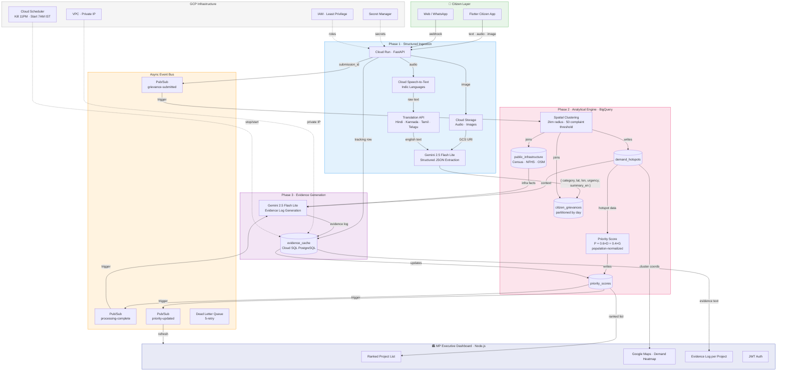

# JanMat — People's Priority Engine
### AI for Constituency Development Planning · Google AI Hackathon Track 1

> *"Turn unstructured citizen voices into ranked, evidence-backed development projects an MP can act on — with zero bias and full transparency."*

---

## The Problem

Every MP faces the same impossible situation: hundreds of development requests arrive through public meetings, WhatsApp messages, grievance portals, and letters — while the local development plan lists dozens of competing proposed projects, each with a vocal constituency behind it. There is no objective way to:

- Know which requests are recurring vs. one-off
- Map where the highest-density demand actually is
- Compare a school upgrade request against real enrollment and travel-distance data
- Justify a funding decision to constituents without appearing biased

The result: the loudest voice wins. Rural underserved communities lose to dense urban areas. Critical infrastructure gaps go unaddressed because no one quantified them.

**JanMat fixes this.**

---

## What JanMat Does

JanMat is a three-layer AI platform that:

1. **Ingests** unstructured citizen feedback in any format (voice, text, photo) in any Indian language
2. **Analyzes** it to surface geographic demand hotspots and recurring themes
3. **Cross-references** citizen demand against real public datasets (Census, NFHS, infrastructure gaps)
4. **Outputs** a ranked, evidence-grounded list of development projects the MP can act on immediately

Every recommendation comes with a transparent **Evidence Log** — a machine-generated justification citing exact data — so no project recommendation can be challenged as politically motivated.

---

## Unique Selling Points

| What others build | What JanMat does |
|---|---|
| Chatbot that summarizes complaints | Deterministic parsing engine that converts complaints into structured data |
| Keyword search over feedback | Spatial clustering of demand into geographic hotspots |
| Count of complaints per category | Priority Score P = 0.6 × Demand + 0.4 × Infrastructure Gap |
| Text recommendations | Evidence Log citing Census rows, NFHS metrics, travel distances |
| Urban bias (volume = priority) | Population-normalized scoring prevents dense areas from drowning rural needs |
| English-only portals | Full Indic language pipeline: voice → STT → Translation → Gemini |

**The core insight:** Gemini is never used as a chatbot. It is used as a **deterministic parsing and reasoning agent** — every output is validated against a strict Pydantic schema and written directly to BigQuery. No hallucinated recommendations, no freeform summaries without data backing.

---

## Architecture



---

## System Flow — Step by Step

### Phase 1 · Citizen Ingestion (Async Pipeline)

A citizen submits feedback via the Flutter app or web interface. The system accepts three input types:

**Text** — typed in any Indian language. Gemini handles multilingual parsing directly.

**Audio** — voice note in Hindi, Kannada, Tamil, Telugu, Bengali, or any supported Indic language. Cloud Speech-to-Text transcribes it, the Translation API normalizes it to English, and Gemini extracts structured data.

**Image** — photo of a broken road, damaged school, or polluted water source. Stored in Cloud Storage, then passed to Gemini's multimodal vision endpoint.

Gemini is forced to return a strict JSON payload via Pydantic schema validation — no markdown, no freeform text:

```json
{
  "category": "Education",
  "latitude": 13.1007,
  "longitude": 77.5963,
  "urgency_rating": 4,
  "summary_en": "No secondary school within 10km; students travel to Yelahanka daily"
}
```

This payload is streamed directly into BigQuery `citizen_grievances` and the submission status is tracked in Cloud SQL.

---

### Phase 2 · The Analytical Brain (BigQuery)

Once enough submissions accumulate, a BigQuery spatial aggregation query groups complaints into **Demand Hotspots** — geographic clusters where a recurring need is concentrated:

```sql
-- Clusters complaints within 2km radius with 10+ submissions
-- using BigQuery GIS functions (ST_DISTANCE, ST_GEOGPOINT)
```

Each hotspot is cross-referenced against `public_infrastructure` (seeded from Census 2011 + NFHS-5 data), extracting grounding facts like:
- Number of secondary schools within 8km
- Hospital beds per 1,000 population
- % of households with piped water access
- Road quality score from OpenStreetMap

The **Priority Score** formula:

```
P = 0.6 × D + 0.4 × G
```

Where:
- **D (Demand Score)** = normalized complaint volume × average urgency rating
- **G (Gap Index)** = infrastructure deficit derived from public datasets, normalized per capita

Population normalization is applied to prevent dense urban wards from always outranking underserved rural areas with fewer but more critical complaints.

---

### Phase 3 · MP Executive Dashboard

The Node.js dashboard presents a ranked list of proposed projects. For each project, Gemini generates an **Evidence Log** — a transparent, data-backed justification:

> *"Ranked #1: Secondary School Construction, Yelahanka Ward 4.*
> *Grounding: 87 citizen voice submissions over 30 days. Census data shows 0 secondary schools within 8km radius; NFHS-5 records 61% enrollment rate and average teen travel distance of 10.1km. Priority Score: 8.7/10 (Demand: 9.1, Gap Index: 8.1)."*

The dashboard also renders a Google Maps heatmap of all demand clusters, allowing the MP to visually see where development pressure is concentrated.

---

## Tech Stack

| Layer | Technology | Purpose |
|---|---|---|
| Citizen App | Flutter | Cross-platform mobile (iOS + Android) |
| MP Dashboard | Node.js | Web admin interface |
| Backend API | FastAPI (Python) | Core orchestration service |
| Deployment | Cloud Run | Serverless, scales to zero |
| AI / LLM | Gemini 2.5 Flash Lite (Vertex AI) | Structured extraction + Evidence Log |
| Speech | Cloud Speech-to-Text | Indic language voice transcription |
| Translation | Cloud Translation API | Multilingual normalization |
| Analytics DB | BigQuery | Spatial clustering, priority scoring |
| Operational DB | Cloud SQL PostgreSQL 15 | Status tracking, auth, evidence cache |
| Media Storage | Cloud Storage | Audio, images from citizens |
| Event Bus | Cloud Pub/Sub | Async pipeline + DLQ |
| Secrets | Secret Manager | All API keys and credentials |
| Mapping | Google Maps Platform | Demand heatmap, geocoding |
| Networking | VPC + Private IP | Cloud SQL never exposed publicly |
| Cost Control | Cloud Scheduler | Kill DB at 11PM IST, restart 7AM IST |

---

## Citizen Experience

Citizens interact through a **zero-friction Flutter app** designed for low-literacy and rural users:

- **One-tap voice submission** — press and speak in your language. No typing required.
- **Photo complaint** — photograph a broken road, damaged water pump, or crumbling school wall. Send directly.
- **Text in your language** — Hindi, Kannada, Tamil, Telugu, Bengali, Marathi — all supported.
- **No registration required** for submission (anonymous feedback accepted)
- **Complaint tracking** — optional tracking ID to follow up on submission status
- **Submission confirmation** — immediate acknowledgment with category detected and area identified

The app requires no literacy in English. A citizen who has never used a government portal can submit a voice note about a water shortage in 10 seconds.

---

## MP Dashboard Experience

The MP and their office see a **clean executive interface** with no raw complaint data:

- **Ranked project list** — top 10 development projects for the constituency, ordered by Priority Score
- **Evidence Log per project** — one paragraph citing the exact data behind each recommendation
- **Demand heatmap** — Google Maps overlay showing where complaints are geographically concentrated
- **Category breakdown** — Education, Health, Roads, Water, Sanitation — with drill-down per ward
- **Trend view** — how demand has shifted over the past 30/60/90 days
- **Export** — one-click PDF/CSV export of ranked recommendations for official planning documents
- **No raw data** — the MP never sees individual citizen complaints. Only aggregated, anonymized hotspot data is displayed, protecting citizen privacy.

---

## Evaluation Alignment

| Metric | Weight | How JanMat Addresses It |
|---|---|---|
| **Technical Execution** | 25% | Gemini is a deterministic Pydantic-validated parser, not a chatbot. Every output is schema-enforced and written to BigQuery. End-to-end pipeline runs without human intervention. |
| **Deployability & Scalability** | 25% | 100% serverless — Cloud Run scales to zero, BigQuery has no infra to manage, Pub/Sub handles burst traffic. One `terraform apply` provisions the entire stack. |
| **Inclusivity & Accessibility** | 15% | Native Speech-to-Text + Translation pipeline. Citizens with no English literacy submit in voice. Zero app install required for web path. |
| **Problem-Solution Fit** | 20% | Priority Score cross-references citizen demand with real Census and NFHS datasets. Rural infrastructure gaps are quantified, not assumed. Evidence Log eliminates subjective bias. |

---

## Project Structure

```
JanMat/
├── backend/                    # FastAPI service (Cloud Run)
│   ├── app/
│   │   ├── main.py
│   │   ├── routers/
│   │   │   ├── intake.py       # Phase 1: citizen submission endpoints
│   │   │   ├── analytics.py    # Phase 2: clustering + scoring trigger
│   │   │   └── dashboard.py    # Phase 3: MP dashboard API
│   │   └── services/
│   │       ├── gemini.py       # Vertex AI Gemini structured extraction
│   │       ├── speech.py       # Cloud Speech-to-Text
│   │       ├── translation.py  # Translation API
│   │       ├── bigquery.py     # BQ streaming insert + queries
│   │       ├── storage.py      # GCS media upload
│   │       └── pubsub.py       # Pub/Sub publisher
│   ├── Dockerfile
│   └── requirements.txt
├── dashboard/                  # Node.js MP dashboard
├── citizen-app/                # Flutter citizen app
├── infra/
│   ├── terraform/              # Complete GCP infrastructure as code
│   ├── sql/                    # Cloud SQL schema migrations
│   └── scripts/                # Deploy, seed, kill/restart DB scripts
└── bigquery/
    └── queries/                # Clustering, scoring, evidence SQL
```

---

## Quick Start

```bash
# 1. Clone and configure
git clone https://github.com/your-org/janmat
cd JanMat/infra/terraform
cp terraform.tfvars.example terraform.tfvars
# Fill in: project_id, db_password

# 2. Deploy all GCP infrastructure
terraform init && terraform apply

# 3. Populate secrets
echo -n "MAPS_KEY" | gcloud secrets versions add janmat-maps-api-key --data-file=-
openssl rand -hex 32 | gcloud secrets versions add janmat-jwt-secret --data-file=-

# 4. Initialize DB schema
./infra/scripts/db_init.sh YOUR_PROJECT_ID

# 5. Seed mock infrastructure data
python infra/scripts/seed_bigquery.py --project YOUR_PROJECT_ID

# 6. Deploy backend (run from project root — Dockerfile expects root build context)
gcloud builds submit --tag gcr.io/YOUR_PROJECT_ID/janmat-backend \
  --dockerfile backend/Dockerfile .
```

See [`infra/DEPLOY.md`](infra/DEPLOY.md) for full deployment guide.

---

## Cost Budget

Built to run within **$300 GCP free credits** for the POC:

- Cloud SQL `db-f1-micro` stopped nightly via Cloud Scheduler → **~$4–7/month**
- Cloud Run scales to zero when idle → **~$0–3/month**
- BigQuery free tier covers POC query volume → **$0**
- Gemini 2.5 Flash Lite — lowest-cost production Gemini model
- **Total estimated: $10–25/month**

---

*Built for Google AI Hackathon — Track 1: People's Priorities*
