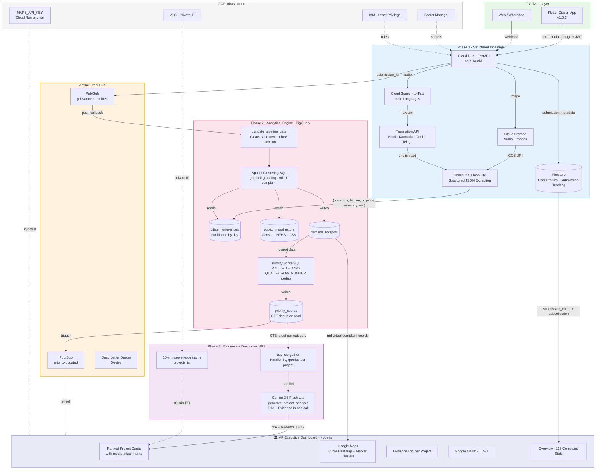

# JanMat — People's Priority Engine
### AI for Constituency Development Planning · Google AI Hackathon Track 1

> *"Turn unstructured citizen voices into ranked, evidence-backed development projects an MP can act on — with zero bias and full transparency."*

---

## The Problem

Every MP faces the same impossible situation: hundreds of development requests arrive through public meetings, WhatsApp messages, grievance portals, and letters — while the local development plan lists dozens of competing proposed projects, each with a vocal constituency behind it. There is no objective way to:

- Know which requests are recurring vs. one-off
- Map where the highest-density demand actually is
- Compare a school upgrade request against real enrollment and travel-distance data
- Justify a funding decision to constituents without appearing biased

The result: the loudest voice wins. Rural underserved communities lose to dense urban areas. Critical infrastructure gaps go unaddressed because no one quantified them.

**JanMat fixes this.**

---

## What JanMat Does

JanMat is a three-phase AI platform that:

1. **Ingests** unstructured citizen feedback in any format (voice, text, photo) in any Indian language
2. **Analyzes** it to surface geographic demand hotspots and recurring themes
3. **Cross-references** citizen demand against real public datasets (Census, NFHS, infrastructure gaps)
4. **Outputs** a ranked, evidence-grounded list of development projects the MP can act on immediately

Every recommendation comes with a transparent **Evidence Log** — a machine-generated justification citing exact data — so no project recommendation can be challenged as politically motivated.

---

## Unique Selling Points

| What others build | What JanMat does |
|---|---|
| Chatbot that summarizes complaints | Deterministic parsing engine that converts complaints into structured data |
| Keyword search over feedback | Spatial clustering of demand into geographic hotspots |
| Count of complaints per category | Priority Score P = 0.6 × Demand + 0.4 × Infrastructure Gap |
| Text recommendations | Evidence Log citing Census rows, NFHS metrics, travel distances |
| Urban bias (volume = priority) | Population-normalized scoring prevents dense areas from drowning rural needs |
| English-only portals | Full Indic language pipeline: voice → STT → Translation → Gemini |

**The core insight:** Gemini is never used as a chatbot. It is used as a **deterministic parsing and reasoning agent** — every output is validated against a strict Pydantic schema and written directly to BigQuery. No hallucinated recommendations, no freeform summaries without data backing.

---

## Architecture



---

## System Flow — Step by Step

### Phase 1 · Citizen Ingestion

A citizen submits feedback via the Flutter app. The system accepts three input types:

**Text** — typed in any Indian language. Gemini handles multilingual parsing directly.

**Audio** — voice note in Hindi, Kannada, Tamil, Telugu, Bengali, or any supported Indic language. Cloud Speech-to-Text transcribes it, the Translation API normalizes it to English, and Gemini extracts structured data.

**Image** — photo of a broken road, damaged school, or polluted water source. Stored in Cloud Storage, then passed to Gemini's multimodal vision endpoint.

Gemini is forced to return a strict JSON payload via Pydantic schema validation — no markdown, no freeform text:

```json
{
  "category": "Roads",
  "latitude": 13.1378,
  "longitude": 77.5719,
  "urgency_rating": 4,
  "summary_en": "Pothole-ridden road near Yelahanka causing vehicle damage"
}
```

This payload is streamed into BigQuery `citizen_grievances`. Submission metadata (category, urgency, summary) is also written to a Firestore subcollection under the user's document, and the user's `submission_count` is atomically incremented. The citizen immediately receives a `SubmissionResult` card showing their category and urgency rating.

---

### Phase 2 · The Analytical Pipeline (BigQuery)

Every new submission triggers a Pub/Sub push to the `/analytics/pubsub/callback` endpoint, which runs the full pipeline:

1. **Truncation** — `truncate_pipeline_data()` issues DML DELETE on `demand_hotspots` and `priority_scores` for the constituency before inserting fresh data, preventing row accumulation across pipeline runs.

2. **Spatial Clustering** — a BigQuery SQL query groups complaints into grid cells by `(category, constituency_id, grid_lat, grid_lon)`, where `grid_lat = ROUND(latitude / 0.018) * 0.018` (~2km cells). Each cell with at least 1 complaint becomes a **Demand Hotspot**.

3. **Priority Scoring** — `priority_scoring.sql` joins the latest hotspot per category against `public_infrastructure` to compute:

```
P = 0.6 × D (Demand Score) + 0.4 × G (Gap Index)
```

Where:
- **D** = `(complaint_count × avg_urgency) / affected_population × 1000`, normalized 0–1 within the constituency
- **G** = infrastructure deficit from Census/NFHS data (e.g. low road quality score → high gap index), defaults to 0.5 when no infra data exists

The SQL uses `QUALIFY ROW_NUMBER() OVER (PARTITION BY category ORDER BY computed_at DESC) = 1` to guarantee exactly one result per category regardless of how many accumulated rows exist.

4. **Results** are inserted to `priority_scores` as ranked rows ordered by `priority_score DESC`.

---

### Phase 3 · MP Dashboard

The Node.js dashboard serves a clean executive interface. When the MP opens the Projects tab, the backend:

1. Runs `get_priority_ranking()` — a CTE query that reads the single latest score per category from `priority_scores` and joins it against the latest hotspot coordinates from `demand_hotspots`, joining on `category` (not UUID) to be robust across pipeline runs.

2. For each ranked project, fires **parallel BigQuery queries** via `asyncio.gather()`:
   - `get_infrastructure_facts()` — infrastructure baseline for the category
   - `get_complaint_samples()` — top urgency complaint summaries
   - `get_project_media()` — GCS URIs for any image or audio submissions in the category

3. Makes a **single Gemini call** (`generate_project_analysis()`) returning JSON `{"title": "...", "evidence": "..."}` — combining what was previously two separate calls. Falls back to the SQL-generated `suggested_project` on any Gemini failure.

4. Returns all projects sorted by rank, with media attachments — images show a thumbnail + caption; audio shows the full Gemini-generated summary in a styled box plus a player.

Results are cached server-side for 10 minutes (configurable `_projectsCache` TTL in `server.js`). Wall time dropped from ~30s to ~3–5s per cache miss.

---

### Demand Heatmap

The heatmap page fetches individual `citizen_grievances` GPS coordinates (not cluster centroids) to create an accurate density visualization. Points are rendered as **color-graded `google.maps.Circle` overlays** — blue for low density, scaling through cyan/yellow to red for high density — with radius proportional to complaint weight (300m minimum, up to 1.5km). This replaced the Google Maps `HeatmapLayer` which was removed in Maps API v3.65.

The marker mode renders individual complaint pins clustered via `@googlemaps/markerclusterer`, color-coded by category, with info windows showing summary and urgency.

---

## Tech Stack

| Layer | Technology | Purpose |
|---|---|---|
| Citizen App | Flutter 3 (Dart) · v1.0.3 | Cross-platform mobile (iOS + Android) |
| MP Dashboard | Node.js · Express | Web executive interface |
| Backend API | FastAPI (Python 3.12) | Core orchestration — all three phases |
| Deployment | Cloud Run · asia-south1 | Serverless, scales to zero |
| AI / LLM | Gemini 2.5 Flash Lite (Vertex AI) | Structured extraction + Evidence Log (single combined call) |
| Speech | Cloud Speech-to-Text | Indic language voice transcription |
| Translation | Cloud Translation API | Multilingual normalization |
| Analytics DB | BigQuery | Spatial clustering, priority scoring, CTE deduplication |
| User Storage | Cloud Firestore | User profiles, submission tracking, `submission_count` |
| Media Storage | Cloud Storage | Audio, images from citizens |
| Event Bus | Cloud Pub/Sub + DLQ | Async pipeline trigger with 5-retry dead letter queue |
| Secrets | Secret Manager | All API keys and credentials |
| Mapping | Google Maps Platform | Circle heatmap overlays, marker clustering, geocoding |
| Networking | VPC + Private IP | Secure service-to-service communication |

---

## Citizen App (Flutter)

The Flutter citizen app (`citizen-app/`) targets Android (iOS ready). Key features:

- **Voice submission** — press and hold to record. Cloud STT transcribes in any Indic language.
- **Photo complaint** — photograph broken infrastructure. Gemini vision extracts the issue.
- **Text in your language** — Hindi, Kannada, Tamil, Telugu, Bengali, Marathi all supported.
- **Firebase Phone OTP auth** — citizens authenticate with their phone number, no email required.
- **Submission result card** (`ResultCard`) — after every submission, shows detected category, urgency rating (1–5), and Gemini-generated English summary.
- **Home screen stats** — real counts from `/users/stats` endpoint: total submitted, processed, pending — pulled from Firestore `submission_count` and submissions subcollection.
- **Submission history** — full history of own submissions with category and summary.
- **In-app update** — checks GitHub Releases API for newer APK. Downloads and triggers Android installer. Shows "Install started — restart app to complete" after install rather than looping back to "update available".
- **Citizen logo** — branded app identity in the home screen hero header.

Current version: **1.0.3+3**

---

## MP Dashboard

The Node.js dashboard (`dashboard/`) is deployed on Cloud Run. Key screens:

**Overview** — constituency-level stats: total submissions, category breakdown, recent activity.

**Projects** — ranked development project cards, each showing:
- Project title (Gemini-generated, specific to the complaint data)
- Priority score and rank
- Evidence log paragraph
- Infrastructure gap index and demand score
- Complaint count and average urgency
- Media attachments: audio submissions show the Gemini English summary; image submissions show a thumbnail with caption

**Heatmap** — Google Maps with two modes:
- 🔥 Heatmap: color-graded circle overlays from individual complaint GPS coordinates
- 📍 Markers: clustered pins per individual complaint, color-coded by category

**Users** — citizen registration stats and constituency demographics (MP view only).

Authentication is Google OAuth2. The MAPS_API_KEY is injected as a Cloud Run environment variable — not hardcoded.

---

## Backend API (FastAPI)

Deployed at `https://janmat-backend-w2w3osjaua-el.a.run.app`. Key routers:

### `/intake` — Phase 1 ingestion
- `POST /intake/text` — text complaint in any language
- `POST /intake/audio` — voice note (UploadFile)
- `POST /intake/image` — photo (UploadFile)
- `GET /intake/status/{submission_id}` — processing status

### `/users` — Citizen user management
- `POST /users/auth` — Firebase phone OTP → our JWT
- `POST /users/profile` — create/update profile
- `GET /users/profile` — own profile
- `GET /users/stats` — real submission stats (total, processed, pending, by_category) from Firestore
- `GET /users/submissions` — own submission history from Firestore subcollection
- `GET /users/heatmap/{pin_code}` — constituency heatmap data for citizen map view

### `/analytics` — Phase 2 pipeline
- `POST /analytics/cluster` — truncate stale rows, run demand clustering, insert hotspots
- `POST /analytics/score` — compute priority scores from hotspots
- `POST /analytics/pubsub/callback` — Pub/Sub push handler (runs full pipeline in background)
- `GET /analytics/stats/{constituency_id}` — submission volume stats

### `/dashboard` — Phase 3 MP data
- `GET /dashboard/projects?constituency_id=&limit=` — parallel async ranked project list with media, Gemini title + evidence
- `GET /dashboard/heatmap?constituency_id=` — individual complaint coords for map visualization
- `GET /dashboard/map-submissions?constituency_id=` — individual points for marker mode

---

## BigQuery Schema

### `janmat_analytics.citizen_grievances`
Individual complaint rows streamed from the intake pipeline.

| Column | Type | Description |
|---|---|---|
| submission_id | STRING | UUID |
| input_type | STRING | text / audio / image |
| raw_input_gcs_uri | STRING | GCS path to original media |
| source_language | STRING | BCP-47 language code |
| translated_text | STRING | English translation |
| category | STRING | Roads / Sanitation / Health / Education / Water / Electricity / Other |
| latitude | FLOAT64 | GPS latitude |
| longitude | FLOAT64 | GPS longitude |
| summary_en | STRING | Gemini English summary |
| urgency_rating | INT64 | 1–5 |
| processing_status | STRING | processed / error |
| submitted_at | TIMESTAMP | |
| constituency_id | STRING | e.g. KA-BLR-NORTH-01 |

### `janmat_analytics.demand_hotspots`
Grid-cell clusters from the spatial aggregation query.

| Column | Type | Description |
|---|---|---|
| hotspot_id | STRING | UUID generated per pipeline run |
| category | STRING | Category being clustered |
| center_lat / center_lon | FLOAT64 | Average GPS center of cluster |
| radius_km | FLOAT64 | Fixed 2.0km |
| complaint_count | INT64 | Complaints in this grid cell |
| avg_urgency | FLOAT64 | Mean urgency rating |
| affected_population | INT64 | complaint_count × 150 (estimated) |
| constituency_id | STRING | |
| computed_at | TIMESTAMP | Pipeline run time |

### `janmat_analytics.priority_scores`
Scored + ranked output per pipeline run.

| Column | Type | Description |
|---|---|---|
| score_id | STRING | UUID |
| hotspot_id | STRING | Foreign key to demand_hotspots |
| category | STRING | |
| rank | INT64 | 1 = highest priority |
| priority_score | FLOAT64 | P = 0.6D + 0.4G, scaled 0–10 |
| demand_score | FLOAT64 | Normalized complaint density |
| gap_index | FLOAT64 | Infrastructure deficit 0–1 |
| suggested_project | STRING | SQL-generated fallback title |
| generated_at | TIMESTAMP | |

---

## Key Design Decisions

**CTE-based deduplication over UUID joins** — `priority_scores` and `demand_hotspots` accumulate rows across pipeline runs (BigQuery streaming buffer blocks DML DELETE on recently inserted rows). `get_priority_ranking()` uses a CTE with `ROW_NUMBER() OVER (PARTITION BY category ORDER BY generated_at DESC) = 1` to always return exactly one result per category, regardless of accumulated rows. The join is on `category` not `hotspot_id` UUID, so it's robust across runs.

**`asyncio.gather()` for parallelism** — the dashboard endpoint previously processed projects sequentially (~6 seconds per project × N projects). Now all per-project BigQuery queries and Gemini calls run in parallel via `asyncio.gather()`, reducing wall time from 30+ seconds to 3–5 seconds.

**Single Gemini call per project** — `generate_project_analysis()` returns `{"title": "...", "evidence": "..."}` in one prompt, halving API call count vs. the previous two-call approach.

**Individual complaint points for heatmap** — the heatmap uses `citizen_grievances` GPS coordinates rather than `demand_hotspot` centroids. Cluster centroids at 2–3 unique coordinates look like dots; individual complaint points create a real density visualization.

**Circle overlays instead of HeatmapLayer** — Google Maps JS API v3.65 removed `HeatmapLayer` from the `visualization` library. The heatmap is now rendered as `google.maps.Circle` overlays with color (blue→red) and radius proportional to complaint weight. No external dependencies.

**Firestore for user stats** — user submission counts are tracked in Firestore via atomic `Increment` on every submission, with individual submission documents in a subcollection. The `/users/stats` endpoint reads these for real-time stats rather than querying BigQuery per user.

---

## Project Structure

```
jan-mat-googlehack/
├── backend/                         # FastAPI service (Cloud Run)
│   ├── app/
│   │   ├── main.py
│   │   ├── config.py                # Settings / env vars
│   │   ├── routers/
│   │   │   ├── intake.py            # Phase 1: submission endpoints + Firestore tracking
│   │   │   ├── analytics.py         # Phase 2: clustering + scoring + Pub/Sub callback
│   │   │   ├── dashboard.py         # Phase 3: parallel async project list + heatmap
│   │   │   └── users.py             # Citizen auth, profile, stats, submissions
│   │   └── services/
│   │       ├── gemini.py            # Vertex AI: structured extraction + generate_project_analysis()
│   │       ├── speech.py            # Cloud Speech-to-Text
│   │       ├── translation.py       # Translation API
│   │       ├── bigquery.py          # BQ queries: CTE dedup, truncation, heatmap, media
│   │       ├── storage.py           # GCS media upload
│   │       └── pubsub.py            # Pub/Sub publisher
│   ├── Dockerfile
│   └── requirements.txt
├── dashboard/                       # Node.js MP dashboard (Cloud Run)
│   ├── server.js                    # Express proxy + 10-min project cache
│   └── public/
│       ├── dashboard.html           # Single-page app: projects, heatmap, users, overview
│       └── mp_logo.jpeg             # MP branding logo
├── citizen-app/                     # Flutter citizen app (Android / iOS)
│   ├── lib/
│   │   ├── main.dart
│   │   ├── screens/
│   │   │   ├── home_screen.dart     # Hero header with logo + real stats
│   │   │   ├── text_screen.dart     # Text submission
│   │   │   ├── audio_screen.dart    # Voice submission
│   │   │   ├── image_screen.dart    # Photo submission
│   │   │   ├── about_screen.dart    # In-app update checker (GitHub Releases)
│   │   │   └── status_screen.dart   # Submission tracking
│   │   ├── widgets/
│   │   │   └── result_card.dart     # Post-submission result display
│   │   └── services/
│   │       ├── api_service.dart     # HTTP client + SubmissionResult class
│   │       └── user_service.dart    # Profile, stats, heatmap
│   ├── assets/
│   │   └── citizen_logo.jpeg        # App branding logo
│   └── pubspec.yaml                 # version: 1.0.3+3
├── bigquery/
│   └── queries/
│       ├── demand_clustering.sql    # Grid-cell spatial aggregation
│       └── priority_scoring.sql    # P = 0.6D + 0.4G with QUALIFY dedup
└── infra/
    ├── terraform/                   # Complete GCP infrastructure as code
    └── DEPLOY.md
```

---

## Deployment

**GCP Project:** `project-f0fb8de7-7240-4128-965`  
**Region:** `asia-south1` (Mumbai)  
**Backend URL:** `https://janmat-backend-w2w3osjaua-el.a.run.app`

```bash
# Deploy backend
cd backend
gcloud builds submit --tag gcr.io/project-f0fb8de7-7240-4128-965/janmat-backend --project project-f0fb8de7-7240-4128-965 .
gcloud run services update janmat-backend --image gcr.io/project-f0fb8de7-7240-4128-965/janmat-backend --region asia-south1

# Set Maps API key for dashboard
gcloud run services update janmat-dashboard --update-env-vars MAPS_API_KEY=<YOUR_KEY> --region asia-south1

# Run pipeline manually (after backend deploy)
curl -X POST https://janmat-backend-w2w3osjaua-el.a.run.app/analytics/cluster \
  -H "Content-Type: application/json" \
  -d '{"constituency_id": "KA-BLR-NORTH-01"}'

curl -X POST https://janmat-backend-w2w3osjaua-el.a.run.app/analytics/score \
  -H "Content-Type: application/json" \
  -d '{"constituency_id": "KA-BLR-NORTH-01"}'
```

**BigQuery cleanup** (run if demand_hotspots / priority_scores have stale accumulated rows — only works after the 90-minute streaming buffer window):

```sql
DELETE FROM `project-f0fb8de7-7240-4128-965.janmat_analytics.demand_hotspots` WHERE TRUE;
DELETE FROM `project-f0fb8de7-7240-4128-965.janmat_analytics.priority_scores` WHERE TRUE;
```

**Build Flutter APK for release:**
```bash
cd citizen-app
flutter build apk --release
# Upload build/app/outputs/flutter-apk/app-release.apk to GitHub Release v1.0.3
```

---

## Cost Budget

Built to run within **$300 GCP free credits** for the POC:

- Cloud Run scales to zero when idle → **~$0–3/month**
- BigQuery free tier covers POC query volume → **$0**
- Firestore free tier (1GB storage, 50K reads/day) → **$0**
- Gemini 2.5 Flash Lite — lowest-cost production Gemini model
- Cloud Storage minimal usage for POC media → **< $1/month**
- **Total estimated: $5–15/month**

---

## Evaluation Alignment

| Metric | Weight | How JanMat Addresses It |
|---|---|---|
| **Technical Execution** | 25% | Gemini is a deterministic Pydantic-validated parser. Parallel async pipeline (asyncio.gather). CTE deduplication prevents dashboard corruption from multiple pipeline runs. Single combined Gemini call per project. End-to-end pipeline runs without human intervention. |
| **Deployability & Scalability** | 25% | 100% serverless — Cloud Run scales to zero, BigQuery has no infra to manage, Pub/Sub handles burst traffic. MAPS_API_KEY injected as env var, not hardcoded. |
| **Inclusivity & Accessibility** | 15% | Native Speech-to-Text + Translation pipeline. Citizens with no English literacy submit via voice in their language. Flutter app works on low-end Android devices. Firebase Phone OTP — no email required. |
| **Problem-Solution Fit** | 20% | Priority Score cross-references citizen demand with real Census and NFHS datasets. Rural infrastructure gaps are quantified, not assumed. Evidence Log eliminates subjective bias. Population normalization prevents urban volume bias. |

---

*Built for Google AI Hackathon — Track 1: People's Priorities*
